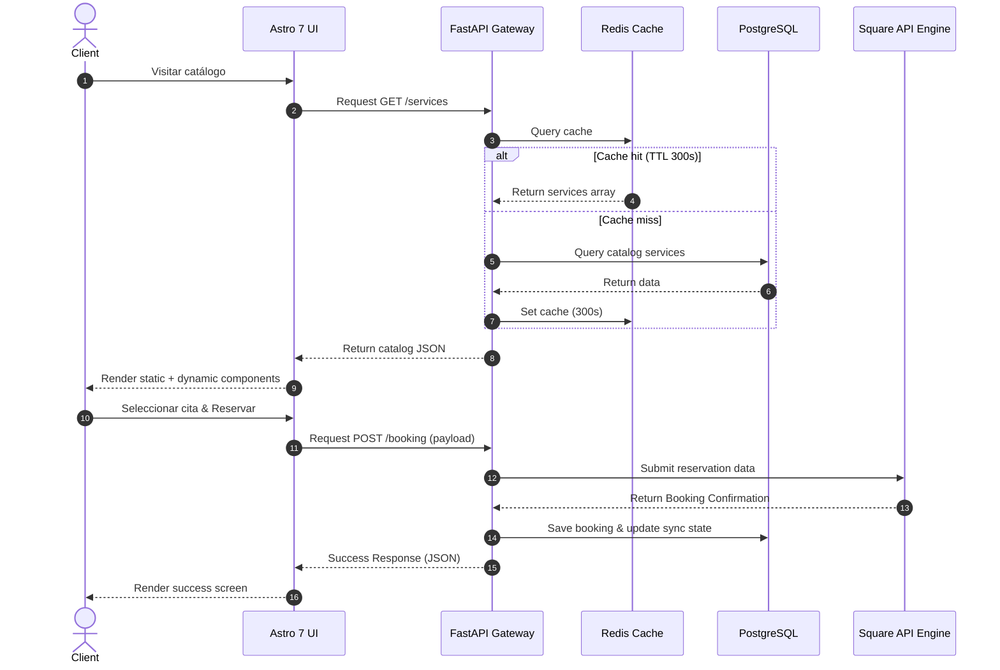

# System Architecture Specification

This document details the software architecture, modular layouts, and technical specifications for the **Lashes & MGlamour Platform**.

---

## 🏗️ Folder Directory Layout

The workspace is organized into separate modules for the Frontend (Astro 7) and Backend (FastAPI microservice):

```text
lashesmglamour/
├── .github/
│   └── workflows/          # GitHub Actions deployment and audit CI/CD pipeline
├── backend/                # Python FastAPI Microservice
│   ├── app/
│   │   ├── __init__.py
│   │   ├── main.py         # FastAPI application initializer
│   │   ├── core/           # Configuration files, security variables, CORS
│   │   ├── database/       # Database connectors, model bindings, connection pool
│   │   ├── models/         # SQLAlchemy 2 declarative models
│   │   ├── repositories/   # Database access layer pattern (Repository pattern)
│   │   ├── services/       # Core business workflows (Service pattern)
│   │   ├── schemas/        # Request & response data validators (Pydantic v2)
│   │   ├── api/            # API routing handlers
│   │   └── scheduler/      # Cron synchronization triggers (runs every 15 mins)
│   ├── alembic/            # Alembic schema version tracking files
│   ├── Dockerfile          # Optimized Python runtime build
│   └── requirements.txt    # Python packaging dependencies
├── frontend/               # Astro 7 Project
│   ├── src/
│   │   ├── layouts/        # Global wrappers with SEO metadata schemas
│   │   ├── pages/          # Static layout route generation files
│   │   ├── components/     # Astro component structures and dynamic React Islands
│   │   ├── styles/
│   │   │   ├── global.css  # Core Tailwind CSS imports
│   │   │   └── tokens.ts   # Design token specifications
│   │   ├── content/        # Content Collections for dynamic blog categories
│   │   └── config.ts       # Frontend endpoints configuration
│   ├── Dockerfile          # Multi-stage Astro build
│   └── package.json        # Node.js manifest configuration
├── designs/                # Official branding, logos, flyers, menus (Read-only)
├── docker-compose.yml      # Local dev environment orchestrator
└── docs/                   # Developer documentation files
```

---

## 🧭 Architectural Principles

We implement enterprise software standards to ensure modularity and reliability:
- **SOLID**: Standard design guidelines across TypeScript modules and Python files.
- **Clean Architecture & Separation of Concerns**:
  - The frontend is strictly for rendering content (Astro) and client-side scheduling wizards (React Islands).
  - The backend is strictly a data synchronizer and a secure booking processing broker.
- **Repository & Service Pattern**:
  - Direct database execution queries are restricted to the `repositories/` layer.
  - Business workflows (catalog mapping, booking validations, staff assignment) are located in the `services/` layer.
- **Strict Typing**: Strict mode configuration for TypeScript (`tsconfig.json`) and type-hinted methods for Python.

---

## 🔄 Core Data Flow



---

## 🔒 Security Infrastructure

To secure transactions and administrator operations:
- **HTTPS & TLS**: Enforced on all communication channels.
- **Cross-Origin Resource Sharing (CORS)**: Restricts API calls to authorized domains (Vercel frontend domain).
- **JWT & OAuth2**: Access to administrative endpoints (panel status, log tracking) is protected via encrypted tokens.
- **Rate Limiting**: Configured at Nginx and FastAPI middleware levels to prevent denial-of-service attempts.
- **Secret Management**: API keys (`SQUARE_ACCESS_TOKEN`, database passwords, JWT salts) are isolated via environment variables.

---

## 📈 Performance Targets
- **Lighthouse Score**: Target `100/100` on Performance, Accessibility, Best Practices, and SEO.
- **Astro Islands**: Interactive islands are deferred using `client:visible` or `client:idle` directives to prevent blocking main-thread rendering.
- **Redis Cache**: 300-second TTL limits API database trips for repeated visitors.
