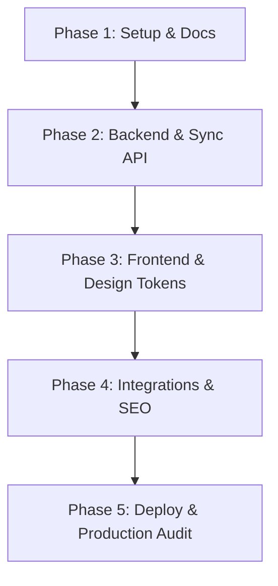

# Roadmap — Lashes & MGlamour Platform

This roadmap defines the milestone target goals, sequencing, and timeline for the end-to-end development of the **Lashes & MGlamour Platform**.

---

## 🗺️ Phases Overview

---

## 📍 Milestones

### Phase 1: Setup, Repository & Documentation Setup (Completed)
- [x] Repository initialization with standard Git strategy branching (`main`, `develop`).
- [x] Configure standard files: `.gitignore`, `CONTRIBUTING.md`.
- [x] Save Master Prompt guidelines into `docs/PROMPT_MAESTRO.md`.
- [x] Create project tracking files: `TODO.md`, `PROJECT_STATUS.md`, `ROADMAP.md`.
- [x] Design technical specifications under `docs/` (`BRAND-GUIDE.md`, `API.md`, `DATABASE.md`, `DEPLOYMENT.md`, `SQUARE.md`, `SEO.md`).

### Phase 2: Backend API Engine & Square Connector (Completed)
- [x] Initialize Python environment (3.12) with FastAPI.
- [x] Configure database connectors (PostgreSQL) and database tracking with Alembic migrations.
- [x] Implement Square SDK integrations for services download and mapping.
- [x] Set up background synchronizer loops running every 15 minutes (using Redis caching TTL 300s).
- [x] Implement booking creation, updates, cancellation, and staff availability APIs.
- [x] Code webhook receivers for Square status events.

### Phase 3: Frontend Development & Design System (Completed)
- [x] Analyze the `/designs` assets folder to retrieve typography, colors, and the official logo.
- [x] Define styling tokens at `src/styles/tokens.ts` (Tailwind configuration).
- [x] Build key layout sections (`BrandHero`, `PriceCard`, `FAQ`, headers, footers).
- [x] Configure Astro Content Collections for the blog.
- [x] Assemble interactive Islands (Booking Calendar Wizard using React Hook Form + TanStack Query).
- [x] Set up the administration portal to track logs, synchronize catalog manual triggers, and update blogs.

### Phase 4: Integrations, SEO Local & CRO Optimizations (Completed)
- [x] Integrate local search schemas (NAP, LocalBusiness JSON-LD, Breadcrumbs).
- [x] Set up analytics metrics (GA4, GTM, Meta Pixel, WhatsApp floats).
- [x] Embed Google Maps APIs and Google Reviews slider.
- [x] Configure automated SEO headers (Title, description, canonicals) dynamically per page.

### Phase 5: Containerization, Deployment & Auditing (Completed)
- [x] Configure multi-stage Dockerfiles for Astro and FastAPI.
- [x] Compose `docker-compose.yml` for database, cache, proxy (Nginx), and microservices.
- [x] Write GitHub Actions for automated linting, checking, building, and deployments.
- [x] Run security audits (CORS, Rate limits, JWT validations) and performance tests (Core Web Vitals 100/100).
