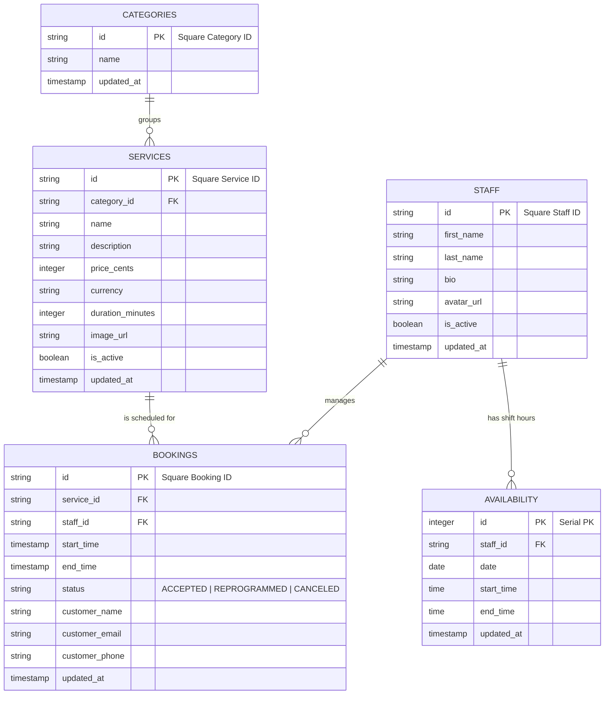

# Database Design & Cache Strategy

This specification details the relational schema design for **PostgreSQL** (managed through **SQLAlchemy 2** and **Alembic**) and the memory caching schemas configured in **Redis**.

---

## 🗄️ PostgreSQL Relational Schema

We maintain a local database layer to store synchronized catalog configurations and booking records. This guarantees swift API responses (cache-miss fallback) and maintains historical records.



---

## 🗂️ Indexes Optimization

To speed up high-frequency API query operations:
- **`idx_services_category`**: Index on `services.category_id` to quickly filter services.
- **`idx_bookings_time_staff`**: Composite index on `(bookings.start_time, bookings.staff_id)` to quickly verify booking conflicts.
- **`idx_availability_date_staff`**: Composite index on `(availability.date, availability.staff_id)` to search available shifts.

---

## ⚡ Redis Caching Specification

We use **Redis** to eliminate redundant DB queries and guarantee sub-100ms API response times.

### TTL Rules & Key Schemas
- **Key: `services:all`**
  - **Type**: String (JSON-serialized array of services).
  - **TTL**: 300 seconds.
  - **Invalidation**: Cleared on `catalog.updated` Webhook trigger or manually via Admin Panel.
- **Key: `services:cat:{category_id}`**
  - **Type**: String (JSON-serialized array of services matching a category).
  - **TTL**: 300 seconds.
- **Key: `staff:all`**
  - **Type**: String (JSON-serialized array of staff members).
  - **TTL**: 300 seconds.
- **Key: `availability:{service_id}:{date}`**
  - **Type**: String (JSON array of timestamps slots).
  - **TTL**: 300 seconds.

---

## 🔄 Database Migrations (Alembic)

Migrations are tracked incrementally via python scripts in `backend/alembic/versions/`.
- **Command to generate migration**:
  ```bash
  alembic revision --autogenerate -m "description of changes"
  ```
- **Command to run migrations**:
  ```bash
  alembic upgrade head
  ```
- No database model structure modifications can be performed directly via raw SQL queries.
